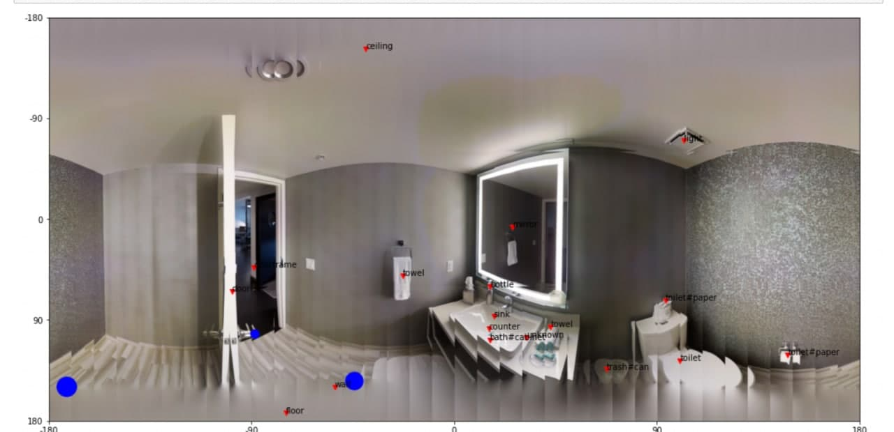

# 360-visualization
IA LAB PUC Research on VLN task, visualization fo 360° indoor environments on Matterport simulator.

We take the Matterport metadata and make it readily available to enhance tasks built on this dataset, such as the Visual and Language Navigation (VLN) task.

  
  <i>Fig. 1: Objects and reachable viewpoints visualization</i>

### Authors:

- Benjamin Earle (https://www.linkedin.com/in/benjamin-earle/)
- Joaquin Ossandón (https://www.linkedin.com/in/joaquin-ossandon/)

---
## Repository distribution

    ├── LICENSE
    ├── README.md
    ├── docs/
    ├── img/
    ├── connectivity/ 👉🏽 Folder containing connectivity graphs of each scan/house
    ├── metadata_parser/
    │   ├── house_cache/ 👉🏽 Folder containing serialized house metadata (with Pickle)
    │   │   ├── 17DRP5sb8fy.pickle
    │   │   ├── 1LXtFkjw3qL.pickle
    │   │   ├── {...}.pickle
    │   └── parse_house_segmentations.py 👉🏽 Script for generating house metadata pickles
    └── slurm_scripts/ 👉🏽 Scripts for running repository scripts on Slurm (specifically on IA Lab Cluster)
        ├── jupyter_on_slurm.sh
        └── python_on_slurm.sh
    ├── data_explorer.ipynb 👉🏽 Explore the metadata of Matterport simulator, by house and viewpoint nodes.
    ├── simulator_visualization.ipynb 👉🏽 Jupyter Notebook to visualize objects coordinates and reachable viewpoints on 360° views, from Simulator
    ├── requirements.txt 👉🏽 All Python libraries for running the project

---

## Installation

If you are member of the IA Lab (PUC), it is already installed on the servers, so the next steps are not necessary unless you would like to run on local.

We recommend following `@peteanderson80` [R2R paper guide](https://github.com/peteanderson80/Matterport3DSimulator) for a successfully installation of Matterport simulator
and all requirements for visualizing.

Some advices:
- Strongly recommended to follow the Docker setup.
- When running `cmake`, use `cmake -DEGL_RENDERING=ON ..`, because we will use downloaded images. Also, this allows for off-screen rendering in the GPU.

As it says, you also will need to download the dataset. For object visualization you will need to follow [this guide](docs/objects_visualization_data.md).

---
## Run

You can run the notebooks with `jupyter notebook` command.

Please [this](/docs/simulator_object_visualization.md) guide for use of the object visualization.

---
## (IA Lab only) Run on remote host

For local forwarding on remote server use

    ssh -L localhost:8889:scylla:{PORT} <user>@<host>

where `PORT` is the port exposed by running the Jupyter Notebook.

If you are connecting to [IA LAB](https://ialab.ing.puc.cl/) Cluster, use:

    sbatch /home/mrearle/repos/360-visualization/slurm_scripts/jupyter_on_slurm_gpu.sh
    # or
    sbatch /home/jiossandon/repos/360-visualization/slurm_scripts/jupyter_on_slurm_gpu.sh

you can see the exposed port by using `cat {PATH}`.

and cancel after not use

    scancel <process ID SLURM> # you can review the ID with `sq`
