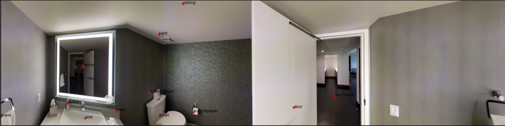

# 360-visualization
IA LAB PUC Research on VLN task, visualization fo 360° indoor environments on Matterport simulator.

We take the Matterport metadata and make it readily available to enhance tasks built on this dataset, such as the Visual and Language Navigation (VLN) task.

  
  <i>Fig. 1: Objects visualization</i>

### Authors:

- Benjamin Earle (https://www.linkedin.com/in/benjamin-earle/)
- Joaquin Ossandón (https://www.linkedin.com/in/joaquin-ossandon/)

---
## Repository distribution

    ├── LICENSE
    ├── README.md
    ├── data_explorer.ipynb 👉🏽 Explore the metadata of Matterport simulator, by house and viewpoint nodes.
    ├── metadata_parser
    │   ├── house_cache 👉🏽 Folder containing serialized house metadata (with Pickle)
    │   │   ├── 17DRP5sb8fy.pickle
    │   │   ├── 1LXtFkjw3qL.pickle
    │   │   ├── {...}.pickle
    │   └── parse_house_segmentations.py 👉🏽 Script for generating house metadata pickles
    ├── objects_visualization.ipynb 👉🏽 Jupyter Notebook to visualize objects coordinates on viewpoint 360° panoramic views
    ├── requirements.txt 👉🏽 All Python libraries for running the project
    └── slurm_scripts 👉🏽 Scripts for running repository scripts on Slurm (specifically on IA Lab Cluster)
        ├── jupyter_on_slurm.sh
        └── python_on_slurm.sh

---

## Installation

We recommend follow `@chihyaoma` [guide](https://github.com/chihyaoma/regretful-agent) for a successfully installation of Matterport simulator
and all requirements for visualizating.

---
## Use on remote host, using SLURM

For local forwarding on remote server use

    ssh -L localhost:8889:scylla:9995 <user>@<host>

If you are connecting to [IA LAB](https://ialab.ing.puc.cl/) Cluster, use:

    sbatch /home/mrearle/repos/360-visualization/scripts/jupyter_on_slurm.sh
    # or
    sbatch /home/jiossandon/repos/360-visualization/scripts/jupyter_on_slurm.sh

and cancel after not use

    scancel <process ID SLURM> # you can review the ID with `sq`
