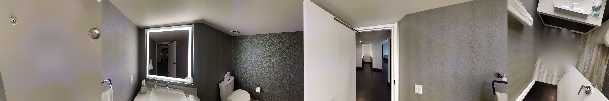

# Matterport3D data for visualization

Before cloning the repository of Matterport3DSimulator and install it, you must download the data.

Download the [Matterport3D Dataset](https://niessner.github.io/Matterport/) which is available after requesting access on the page.

The download script that will be provided allows for downloading of selected data types. At minimum you must download the `matterport_skybox_images` and `undistorted_camera_parameters`.

With those datasets downloaded, after unzip them, you can continue with the guide for installing the simulator. Again, please use Docker so we can provide support in any case.

After installing the simulator, run the script located at the repository of Matterport3D: `Matterport3D/scripts/downsize_skybox.py`. This will generate the small skybox images for visualization, example is shown below.

  
  <i>Small skybox image example</i>

